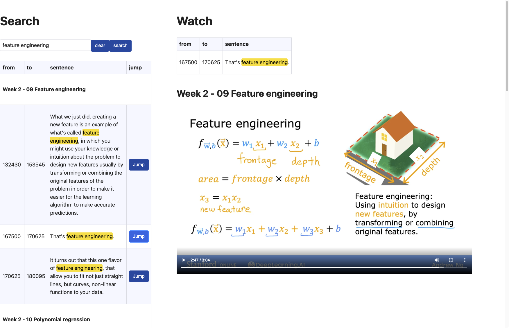

# Subtitle Search

A small webapp that helps you search in subtitles of videos. You can search for words or phrases, and it will open the video at the exact location.



## Prerequisites

You should make sure that the following components are pre-installed on your machine:

- [docker](https://docs.docker.com/engine/install/)

## Using the webapp

I created a docker image that hosts a static fileserver. This serves both the webapp and also the recordings on your machine. 
To give the image access to your files, you need to mount the folder with your recordings to `/assets` inside the docker container.

```shell
docker run --rm \
       -p 8080:8080 \
       -v "/the/path/to/your/assets/:/assets/" \
       --name subtitle-search \
       ghcr.io/flowi/subtitle-search:latest

```

The only requirement is that your assets folder contains a subfolder for each lesson that contains both the mp4 and vtt files. 
The naming and depth doesn't matter - the fileserver will walk the whole directory tree to look for mp4-vtt pairs. 

### Example of a folder structure:

`tree -l .`

```text
.
├── assets
│     └── recordings
│         ├── week 1
│         │     ├── 01 What is machine learning
│         │     │     ├── index.mp4
│         │     │     ├── subtitle.txt
│         │     │     └── subtitles-en.vtt
│         │     ├── 02 Supervised learning part 1
│         │     │     ├── index.mp4
│         │     │     ├── subtitle.txt
│         │     │     └── subtitles-en.vtt
│         ├── week 2
│         │     ├── 01 Multiple Features
│         │     │     ├── index.mp4
│         │     │     ├── subtitle.txt
│         │     │     └── subtitles-en.vtt
│         │     ├── 02 Vectorization part 1
│         │     │     ├── index.mp4
│         │     │     ├── subtitle.txt
│         │     │     └── subtitles-en.vtt
```

## Working in dev mode

### Prerequisites

You should make sure that the following components are pre-installed on your machine:

- [sbt](https://www.scala-sbt.org/download.html)
- [Node.js](https://nodejs.org/en/download/)
- [Yarn](https://yarnpkg.com/en/docs/install)

Run (open two shells)

#### fileserver
```sh
# set the path to your assets folder as an env var
export ASSETS_FOLDER="$PWD/webapp/assets_non_bundled/assets"
sbt dev-fileserver
```

#### webapp

```sh
sbt dev
```

Then open `http://localhost:12345` in your browser.

This sbt-task will start webpack dev server, compile your code each time it changes and auto-reload the page.  
Webpack dev server will stop automatically when you stop the `dev` task
(e.g by hitting `Enter` in the sbt shell while you are in `dev` watch mode).

If you existed ungracefully and your webpack dev server is still open (check with `ps -aef | grep -v grep | grep webpack`),
you can close it by running `fastOptJS::stopWebpackDevServer` in sbt.
